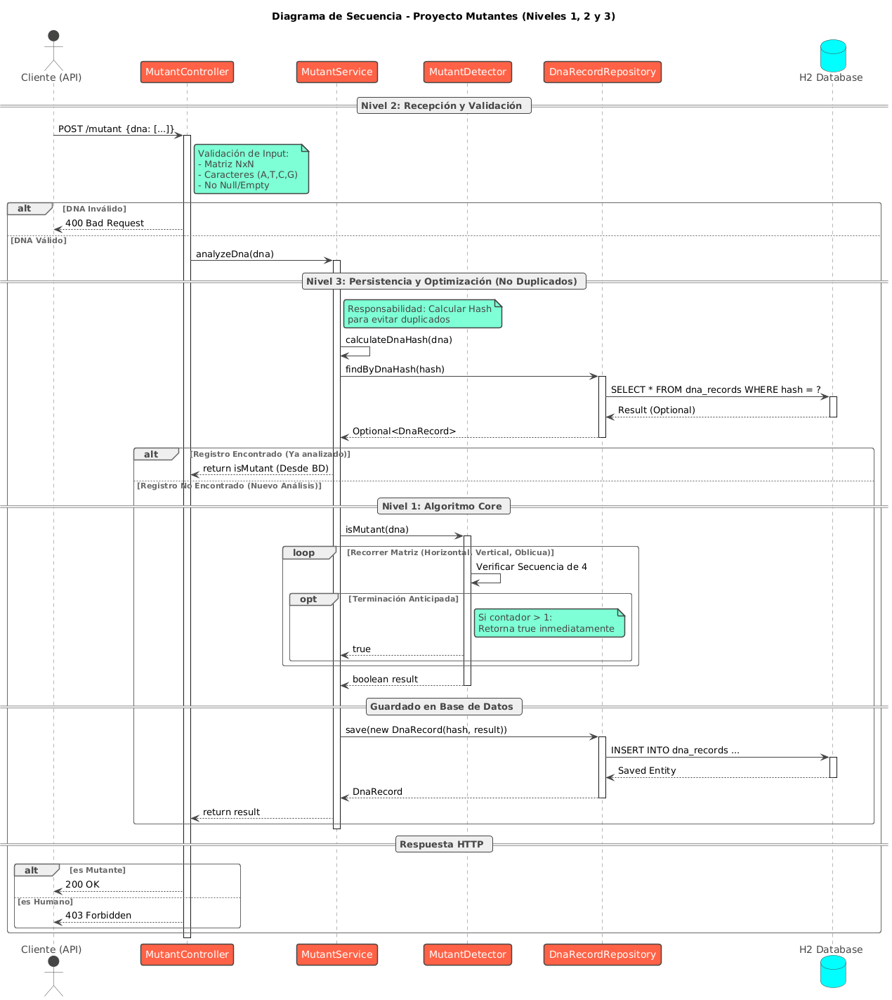
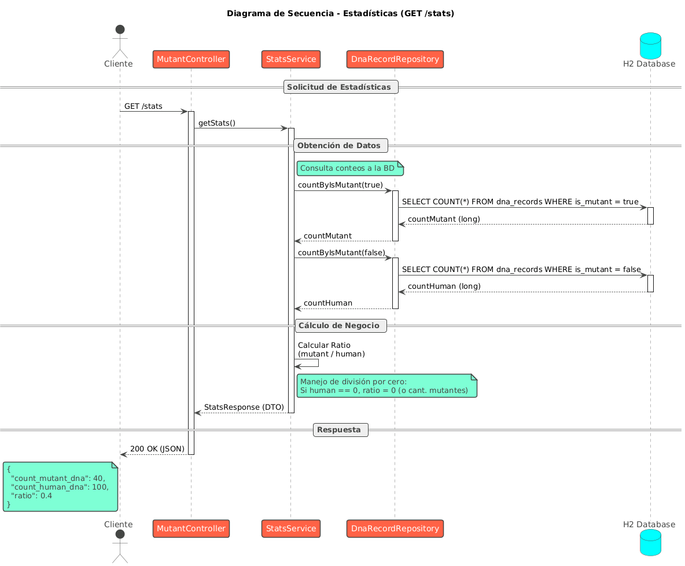

# 🧬 Mutant Detector API 

[](https://www.oracle.com/java/)
[](https://spring.io/projects/spring-boot)
[]()

Este proyecto es la resolucion del global de la materia de Desarrollo de Software de la Universidad Nacional Tecnologica - FRM

---

## 🚀 Despliegue en Producción (Render)

La API se encuentra desplegada y accesible públicamente en el siguiente enlace:

👉 **URL Base:** https://mutantes-garcia.onrender.com/

- **Swagger UI (Documentación Interactiva):** `https://mutantes-garcia.onrender.com/swagger-ui.html`
- **Health Check:** `https://mutantes-garcia.onrender.com/actuator/health`

---

## 📋 Requerimientos Cumplidos

El proyecto aborda los tres niveles de complejidad solicitados en el examen:

1.  **Nivel 1 (Algoritmo):** Lógica eficiente para detectar secuencias de 4 letras iguales (Horizontal, Vertical, Oblicua) con **terminación anticipada** para optimizar el rendimiento.
2.  **Nivel 2 (API REST):** Exposición del servicio mediante Spring Boot con códigos de respuesta HTTP adecuados (200 OK para mutantes, 403 Forbidden para humanos).
3.  **Nivel 3 (Base de Datos y Stats):** Persistencia en **H2 Database**, evitando duplicados mediante **Hashing (SHA-256)** y endpoint de estadísticas.

---

## 🛠️ Tecnologías Utilizadas

* **Lenguaje:** Java 17
* **Framework:** Spring Boot 3.2.0
* **Base de Datos:** H2 Database (Memoria)
* **Build Tool:** Gradle
* **Testing:** JUnit 5, Mockito, JaCoCo
* **Documentación:** OpenAPI (Swagger)

---

## ⚙️ Instrucciones de Ejecución Local

Para ejecutar el proyecto en tu máquina local:

1.  **Clonar el repositorio:**
    ```bash
    git clone [https://github.com/joacogarcia04/Mutantes-Garcia.git](https://github.com/joacogarcia04/Mutantes-Garcia.git)
    cd Mutantes-Garcia
    ```

2.  **Ejecutar la aplicación:**
    * **Windows:**
        ```powershell
        ./gradlew bootRun
        ```
    * **Linux/Mac:**
        ```bash
        ./gradlew bootRun
        ```

3.  **Acceder:**
    * API Local: `http://localhost:8080`
    * Swagger UI: `http://localhost:8080/swagger-ui.html`
    * H2 Console: `http://localhost:8080/h2-console`

---

## 🧪 Tests y Cobertura

El proyecto cuenta con una suite de tests unitarios y de integración que supera el **80% de cobertura**, cumpliendo con los requisitos de calidad del examen.

Para ejecutar los tests y generar el reporte de cobertura:

```bash
./gradlew test jacocoTestReport
```
## 🌐 Endpoints de la API REST

La API expone los siguientes servicios REST:

### 1. POST /mutant/ (Detección de Mutantes)

Este servicio verifica si una secuencia de ADN corresponde a un mutante.

* **Método:** `POST`.
* **Ruta:** `/mutant/`.

#### **Ejemplo de Petición:**
```json
{
    "dna": ["ATGCGA", "CAGTGC", "TTATGT", "AGAAGG", "CCCCTA", "TCACTG"]
}
```
#### **Respuestas HTTP:**

* **200 OK:** Si la secuencia de ADN pertenece a un Mutante.
* **403 Forbidden:** Si la secuencia de ADN pertenece a un Humano (No Mutante).

### 2. GET /stats (Estadísticas de Verificación)

Este servicio expone las estadísticas acumuladas de las verificaciones de ADN persistidas en la base de datos.

* **Método:** `GET`.
* **Ruta:** `/stats/`.

#### **Respuesta HTTP: 200 OK con un cuerpo JSON:**
```json
{
    "count_mutant_dna": 40,
    "count_human_dna": 100,
    "ratio": 0.4
}
```
* **Campos de Respuesta:** Incluye el conteo de ADN mutantes `count_mutant_dna`, el conteo de ADN humanos `count_human_dna`, y el ratio entre ellos.
---

## 📊 Diagramas de Secuencia

Estos diagramas ilustran el flujo de control entre las capas de la aplicación (Controller, Service, Repository, Database) para cumplir con la arquitectura solicitada.

### Detección de Mutantes (POST /mutant)

Muestra el flujo de validación, la verificación de caché (Hash) para evitar duplicados y la ejecución del algoritmo con terminación anticipada.



### Estadísticas (GET /stats)

Muestra cómo se consultan los conteos de mutantes y humanos en la base de datos y se realiza el cálculo del ratio en el servicio.




---

**Desarrollado por:** Joaquín García